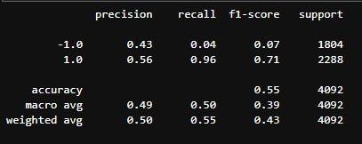
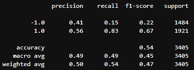

# Module-14

## Objective: To Create an Algorithmic trading bot
### step 1: I imported the dataset and added a column for Actual returns using `pct_change` 

### step 2: Generated the trading signals for the short and long term windows, estabished the Signal column, and set the Strategy Returns column.

### step 3: Splitting the data into the Trainning and test sets using the SMA fast and SMA slow as the X and the y being the Signal column. Setting the period using `DateOffset`, and fitting and scaling the data.

### step 4: Using `SVC` classifier model to fit the data and make predictions

### step 5: Used `classification_report` to see the data from the `SVC` predictions

### step 6: Created a predicitions dataframe for Predicited, Actual, and Strategy Returns.
### step 7: Created a plot showing the Actual vs the Strategy Returns.

# Next its time to tune the Baseline Trading Algorithm
### I changed the small and long window and saw the difference in the model, I also changed the `DateOffset` and noticed as I decreased the length of the offset and the long window leaving the small window the same that the Strategy caught up to the Actual results at a point.

### the average was a little more conistent in the recalled compared to the baseline model

# Run my own model
## I choose to use `LogisticRegression` from `sklearn.linear_model`

### I fit the model using `LogisticRegression` and the original data then made predictions.
### Then I Backtest the new model using `classification_report`

### Created predicitions dataframe for the Predicited, Actual, and Strategy Returns, and plotted.

## Did this new model perform better or worse than the provided baseline model?
### The new model performed about the same as the provided baseline model. The averages were around the same point, however the baseline was better at finding the recall of the 1.0 Signal
## Did this new model perform better or worse than your tuned trading algorithm?
### The new model performed around the same as the Tuned model , the difference again was the tuned model finding the recall of the 1.0 Signal

